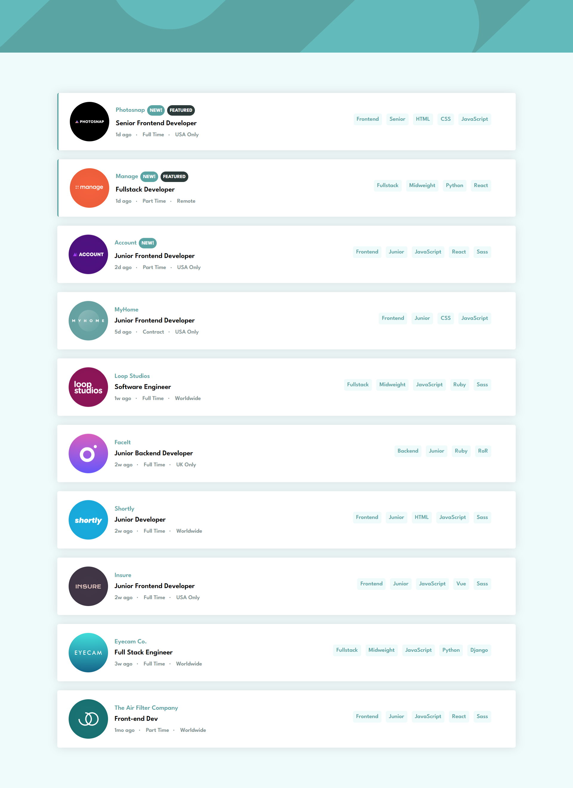
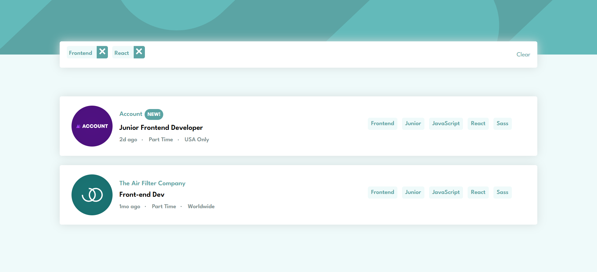

# Frontend Mentor - Job listings with filtering solution

This is a solution to the [Job listings with filtering challenge on Frontend Mentor](https://www.frontendmentor.io/challenges/job-listings-with-filtering-ivstIPCt). Frontend Mentor challenges help you improve your coding skills by building realistic projects. 

## Table of contents

- [Overview](#overview)
  - [The challenge](#the-challenge)
  - [Screenshot](#screenshot)
- [My process](#my-process)
  - [Built with](#built-with)
  - [What I learned](#what-i-learned)
  - [Continued development](#continued-development)
  - [Useful resources](#useful-resources)
- [Author](#author)

## Overview
This challenge entails building a fully functional and responsive job listings page with filtering abilities. It allows a user to filter the available jobs according to specific roles, level and job description. 

### The challenge

Users should be able to:

- View the optimal layout for the site depending on their device's screen size
- See hover states for all interactive elements on the page
- Filter job listings based on the categories

### Screenshot





### Links

## My process
I divided my entire page into two major parts, the header and the job details component. On the job details component, i used a bunch of javascript array methods to implement the various functionalities that are needed acrosss the entire project.

### Built with

- Semantic HTML5 markup
- CSS custom properties
- Flexbox
- Mobile-first workflow
- [React](https://reactjs.org/) - JS library
- [sass](https://sass-lang.com/) - css preprocessor


### What I learned
During the process, i learned how to use the javascript filter and every method effectively, while implementing the filter functionality for the categories of tools and language. In the code snippet below, i checked if the categories are selected and then i checked the updated filter array to filter out all the elements that has a type of tool, went further to use the every method on the filtered array, the every method returns true if the function returns true for all the elements and returns false if the function returns false for just one element, the function checks if jobs.tools array for every value of the previously filtered array if they're present in the job.tools array. 

```Javascript
       (toolCheck ? updatedFilter.filter(f => f.type === "tool").every(f => job.tools.indexOf(f.value) > -1) : true)&&
       (languageCheck ? updatedFilter.filter(f => f.type === "language").every(f => job.languages.indexOf(f.value) > -1) : true)
```

### Continued development
i want to fully master the react array methods and be able to use them easily at my disposal.


### Useful resources

- [Example resource 1](https://www.w3schools.com/jsref/jsref_obj_array.asp) - This helped me understanf array methods better.


## Author

- Fullname - [Oludare Abdulazeez Ajadi]
- Frontend Mentor - [@Abdulazeez782](https://www.frontendmentor.io/profile/Abdulazeez782)
- Twitter - [@ajadii_](https://x.com/ajadii_)
*
